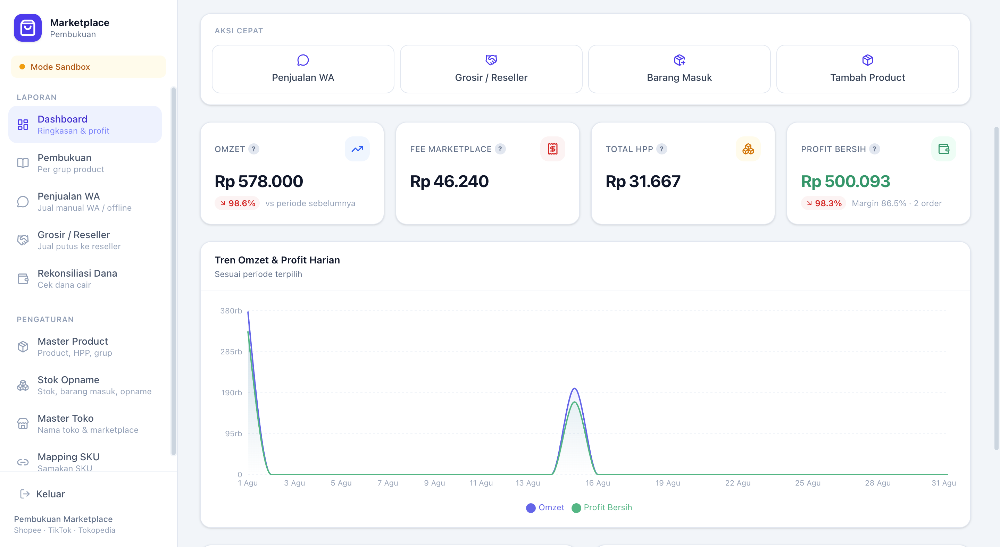

# Marketplace Dashboard

Unified bookkeeping for a multi-channel seller — Shopee, TikTok Shop, and
Tokopedia, plus offline/WhatsApp and reseller sales, in one dashboard (this version is only in Bahasa Indonesia).

Built for a real seller running several marketplace storefronts, who was
reconciling everything by hand across separate seller centers.

## Reports

- **Dashboard** — omzet, profit, and fee summary for any period, with a daily
  trend chart, per-marketplace breakdown, best sellers, in-flight orders, and
  low-stock warnings
- **Pembukuan** — profit per product group, filterable by period, store, and group
- **Penjualan WA** — manual and offline sales, multi-item per transaction
- **Grosir / Reseller** — outright sales tracked per reseller store
- **Rekonsiliasi Dana** — compares the net value of completed orders against
  money actually disbursed, pulling escrow and payout data from marketplace
  APIs, with manual entry for non-API channels
- Excel export across report data

## Master data

- **Products** — HPP, selling prices, bookkeeping groups, bulk price updates,
  bundle/BOM composition
- **Stok Opname** — live stock, restock with HPP snapshot at cost, single and
  bulk counts, min-stock thresholds, 30-day opname reminders
- **Three-tier units** — koli › box › base unit; values stored in base units,
  displayed in whichever tier reads naturally
- **SKU mapping** — each marketplace SKU mapped to an internal product, with
  auto-suggestions, bulk mapping and per-unit base quantities

## Marketplace integration

- **Shopee** — full OAuth flow, signed API client, order sync, webhook receiver
- **TikTok Shop** — OAuth flow, signed client, order sync
- **Tokopedia** — adapter scaffold
- **Sync engine** — idempotent (no duplicate orders), resumable jobs with saved
  cursors and progress tracking, live progress panel, daily cron at 02:00 plus a
  secret-guarded resume endpoint for long runs
- **Adapter pattern** — each marketplace normalizes into one shared shape, so
  API differences never reach the database schema or the UI

## Platform

- **PWA** — installable on mobile, service worker, web push for low stock (VAPID)
- **Auth** — shared-password login with an HMAC-signed session cookie, enforced
  in Edge middleware

## Stack

Next.js 16 · React 19 · TypeScript · Tailwind 4 · Prisma 6 ·
PostgreSQL (Neon) · Recharts · ExcelJS · web-push · Vercel

---

Built by [Ferrey Adinarta](https://ferreyadinarta.vercel.app) ·
[LinkedIn](https://linkedin.com/in/ferrey-adinarta)
